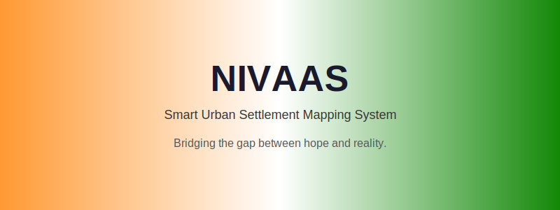

  

<h1 align="center">NIVAAS</h1>
<h3 align="center">Smart Urban Settlement Mapping System</h3>

  <strong>Bridging the gap between hope and reality.</strong>

  
  
  

  <a href="https://www.figma.com/design/CqKJ35W9IJGI1nEKeTRJRG/MAIN?node-id=0-1&p=f"><strong>▶ View Interactive Prototype (Figma)</strong></a>

---

## 📋 Table of Contents

- [Overview](#-overview)
- [Problem Statement](#-problem-statement)
- [Motivation](#-motivation)
- [Stakeholders](#-stakeholders)
- [User Flows](#-user-flows)
- [Features](#-features)
- [Prototype & Screenshots](#-prototype--screenshots)
- [Demo Video](#-demo-video)
- [Research Insights](#-research-insights)
- [Tech Stack](#-tech-stack)
- [Future Improvements](#-future-improvements)
- [Team](#-team)
- [License](#-license)

---

## 🎯 Overview

**NIVAAS** is an HCI prototype platform that helps governments identify, map, and manage illegal settlements and urban encroachments. By aggregating data from multiple stakeholders—slum dwellers, nearby citizens, nodal officers, and government authorities—the system creates a comprehensive view of informal settlements to enable data-driven urban planning, welfare delivery, and humane solutions.

### Key Goals

| Goal | Description |
|------|-------------|
| 🗺️ **Map** | Identify and geo-tag illegal settlements on green belts and footpaths |
| 🏠 **Improve** | Enable targeted interventions to improve living conditions |
| 📋 **Plan** | Support government relocation and rehabilitation planning |
| 🛡️ **Welfare** | Facilitate access to education and government welfare schemes |
| 🏗️ **Infrastructure** | Create sustainable solutions for pollution, traffic, and urban challenges |

---

## ⚠️ Problem Statement

The project addresses **illegal settlements** living on green belts and footpaths by:

- **Mapping** affected populations
- **Identifying** affordable relocation options
- **Improving** living conditions
- **Facilitating** access to education and basic facilities
- **Helping** the government create sustainable and humane solutions for urban challenges like pollution and traffic

---

## 💡 Motivation

We built NIVAAS to tackle illegal settlements in cities across India because these settlements expose people to **life-threatening risks** and poor living conditions:

- **Safety hazards** — Waterlogging, electrocution from faulty wiring, building collapses
- **Human cost** — Children injured or losing lives, road accidents, kidnappings
- **Exclusion** — Lack of legal recognition prevents access to basic facilities and government aid
- **Cycle of poverty** — These issues perpetuate insecurity and marginalization

Our app aims to bridge this gap by **gathering data**, **raising awareness**, and **facilitating solutions** through technology and government collaboration—ensuring safer and more dignified living conditions for those affected.

---

## 👥 Stakeholders

| Stakeholder | Role |
|-------------|------|
| **Slum Dwellers** | People living in slums / disadvantaged communities |
| **Nearby Citizens** | People living nearby in comparatively better housing |
| **Nodal Officers** | Field officers managing verification and response |
| **Government** | Authorities for policy, planning, and resource allocation |

---

## 🔄 User Flows

### General Public / Citizen Flow

- **Add Location on Map** → Turn on location → Save → Thank you page
- **Add Description with Photo** → Turn on camera → Click → Save → Thank you page
- **Report** → Type description → Save → Thank you page
- **Financial Aid** → Donate → Redirect → Thank you page

### Slum Settler Flow

- **Health Emergency** → Call nearest hospital → Report nodal officer → Redirect to conference
- **General Emergency** → Call emergency block → Report nodal officer → Redirect to conference
- **Report / Complaint** → Record audio → Click photo → Save → Thank you page

### Nodal Officer Flow

- **GIS Map & Heat Point** → Google Maps → Overlapping → Intersection map → Summarize & graphing
- **Drone Surveillance Data** → MS Excel → Data summary → Summary
- **AI Generated Risk Map** → AI → Modelling → Prediction with scenario
- **Crowdsourced Data** → Summary & graphing

---

## ✨ Features

| Feature | Description |
|---------|-------------|
| 📸 **Citizen Reporting** | Report illegal settlements via images, location, and description |
| 📋 **Survey & Complaints** | Submit complaints, track grievance status with unique ID |
| 🗺️ **GIS & Heatmap Mapping** | Satellite imagery, drone surveillance, AI-generated risk maps |
| 📊 **Government Analytics** | GIS mapping, statistics, predictive modelling, report generation |
| 🚨 **Emergency Features** | Health emergency, general emergency, helpline integration |
| 🛡️ **Welfare Integration** | Explore eligible schemes, location-based recommendations |
| 🌐 **Multi-language** | English, Hindi, Gujarati, Kannada, Malayalam, Marathi, Punjabi, Tamil, Telugu |

---

## 📸 Prototype & Screenshots

### Interactive Prototype

**[▶ Open Hi-Fi Prototype in Figma](https://www.figma.com/design/CqKJ35W9IJGI1nEKeTRJRG/MAIN?node-id=0-1&p=f)**

The prototype includes:

- **Onboarding** — Welcome, role selection (Nodal Officer / General Citizen / Slum Residents), login, signup, language selection
- **Citizen / Slum Dweller** — Home, Quick Services (Health, Emergency, Welfare, Connect), Report complaint, Track grievance, Schemes, Nodal officer details
- **Nodal Officer / Government** — Profile, GIS mapping, drone survey, crowdsourced images, AI risk map, complaints & surveys, grievance dashboard, field verification, resource allocation

### Key Screens

| Slum Dweller / Citizen | Nodal Officer / Government |
|------------------------|----------------------------|
| Welcome & Role Selection | Profile & Officer Details |
| Home with Quick Services | GIS Mapping & Heat Points |
| Report a Complaint | Drone Survey & Mapping |
| Schemes & Welfare | Crowdsourced Images |
| Grievance Tracking | AI Generated Risk Map |
| Emergency Services | Complaints & Surveys Dashboard |

Screenshots from the prototype are in [`assets/images/ui-screens/`](assets/images/ui-screens/). Diagrams (use case, task flows, mind map, personas) are in [`assets/images/`](assets/images/).

---

## 🎬 Demo Video

### GIF Preview

### Full Video

**[Watch Demo Video](assets/videos/demo.mp4)** — *Full walkthrough of the NIVAAS prototype*

---

## 📚 Research Insights

### Survey Findings (from stakeholder interviews)

- **75%** of respondents consider illegal settlements a **serious problem**
- **62.5%** of participants are members of the general public; **18.8%** government servants; **18.8%** live in illegal settlements
- **Root causes** — Lack of affordable housing (62.5%), migration (68.8%), economic inequality (68.8%)
- **Government priorities** — Better living conditions (72.7%), public safety (72.7%), preventing new settlements (54.5%)
- **Viable solutions** — Strict law enforcement (63.6%), combination of all approaches (63.6%), regularizing with infrastructure (45.5%)
- **Primary challenges** — Lack of resources (75%), legal constraints (66.7%), public opposition (66.7%)
- **Perception** — 72.7% view residents as victims of poor urban planning

### User Testing (Hi-Fi)

> The majority of the general public considers illegal settlements to be a serious problem, and they think the NIVAAS app may help by promoting open communication and offering accurate information. Users found it straightforward to log in, and feedback was positive—many appreciated the user-friendly design and the way it simplifies complex issues. The app was praised for its potential to bring attention to a neglected problem and encourage government action and community collaboration.

### Learning

1. Underlying causes: policy gaps, shortage of affordable housing, urbanization
2. Case studies for local and international approaches
3. Value of community inclusion in decision-making
4. Future-proof design for urban expansion
5. Illegal settlements highlight weaknesses in urban governance
6. Long-term success depends on cooperation between communities, NGOs, private sector, and governments

---

## 🛠️ Tech Stack

### Planned Implementation

| Layer | Technology |
|-------|------------|
| **Frontend** | React / React Native |
| **Backend** | Node.js / Express |
| **Database** | PostgreSQL or Firebase |
| **Mapping** | Google Maps API |
| **AI/ML** | Data clustering, heatmap analysis, predictive modelling |
| **Design** | Figma |

---

## 🚀 Future Improvements

- [ ] Full-stack implementation with React + Node.js
- [ ] Mobile app (React Native) for field data collection
- [ ] Real-time heatmap updates
- [ ] AI-powered settlement boundary detection
- [ ] Integration with government welfare portals
- [ ] Multi-language support (already designed)
- [ ] Offline-first capability for low-connectivity areas
- [ ] Smart technology for preventing and managing settlements

---

## 👨‍💻 Team

| Name | Contribution |
|------|--------------|
| **Satyam** | Team Leader — Workflow, editing, scripting, voice over, problem statement |
| **Shivanshu** | All designing work |
| **Rohan** | Rough work for designs, task flows, mind maps |
| **Raunak** | Rough work for designs, personas |
| **Saksham** | Survey, presentation |

---

## 📄 License

This project is licensed under the **MIT License** — see the [LICENSE](LICENSE) file for details.

---

  <strong>NIVAAS</strong> — Smart Urban Settlement Mapping System 
  <em>Bridging the gap between hope and reality.</em>

